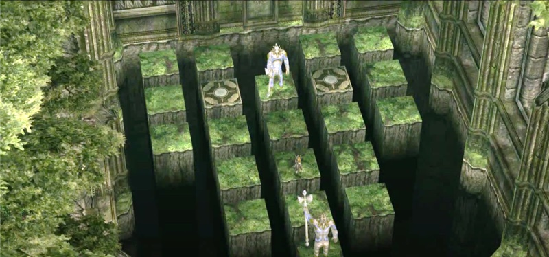

# Zeldalloy

Zeldalloy is a collection of automated solutions to puzzles from games in [The Legend of Zelda][zelda] series. The problems are modelled in first-order logic, and solved by the [Alloy Analyzer][alloy]. Under the hood, Alloy uses a SAT solver to find a solution.

## Usage

First, you will need to [download Alloy][download]. On macOS, you can use `brew cask install alloy`. Then, open the puzzle's `.als` file in Alloy. From there, you can click **Execute** to find a solution, and click **Show** to visualize the instance. Depending on the puzzle, you can:

- Click **Theme > Load Theme...** and choose the correspoding `.thm` file to get a better visualization.

- Copy the output from the Txt tab and paste it as standard input to the corresponding `.py` program.

## Alloy notes

Keep these common stumbling blocks in mind:

- The expression `1 + 2` means the set containing 1 and 2, not the integer 3. To add numbers, you have to use the built-in function `plus`. For example, `1.plus[2] = 3` is true.

- Scopes on `Int` work differently from other sets. `For 4 Int` means using 4-bit signed integers, so from -8 to +7, which gives 16 possible values in total.

## Puzzles

### Sacred Grove

This is the Guardian Statue Puzzle from Twilight Princess. You have to solve it in the Sacred Grove before getting the Master Sword.

All walkthroughs (example [one](https://www.zeldadungeon.net/Zelda11Guardian.php), [two](https://zeldauniverse.net/guides/twilight-princess/sidequests/guardian-statue-puzzle/)) take exactly 13 steps. As expected, Alloy produces no instance until we raise the scope to `for exactly 13 State`.

## License

© 2020 Mitchell Kember

Zeldalloy is available under the MIT License; see LICENSE for details.

[zelda]: https://en.wikipedia.org/wiki/The_Legend_of_Zelda
[alloy]: https://alloytools.org
[download]: https://alloytools.org/download.html
