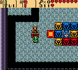

# Crown Statues

- **Game**: Oracle of Ages
- **Location**: Crown Dungeon
- **Name**: Synchronized Statues

## Puzzle

There is a room with an 2 red statues (**R**), 3 blue statues (**B**), 3 Yellow statues (**Y**), and a stationary owl (**x**). Moving a statue causes all same-color statues to move in the same direction (if not blocked). The goal is to surround the owl with the 8 statues. At any step, the player can place a block using the Cane of Somaria (but there can only be one at a time). Statues are not blocked by the edge of the map; they will fall off the edge. Statues can only be pushed, not pulled (i.e. there must be a free spot to stand from which to push).

|       |       | __.__ | __.__ | __.__ | __.__ | __.__ | __.__ | __.__ | __.__ |
| :---: | :---: | :---: | :---: | :---: | :---: | :---: | :---: | :---: | :---: |
|       |       | __B__ | __.__ | __.__ | __.__ | __.__ | __.__ | __.__ | __.__ |
| __B__ | __.__ | __.__ | __.__ | __.__ | __.__ | __.__ | __Y__ | __.__ | __.__ |
| __.__ | __.__ | __R__ | __B__ | __.__ | __x__ | __.__ | __.__ | __.__ | __Y__ |
| __.__ | __.__ | __.__ | __.__ | __.__ | __.__ | __.__ | __Y__ | __.__ | __.__ |
| __.__ | __.__ | __.__ | __.__ | __.__ | __.__ | __R__ | __.__ | __.__ | __.__ |
| __.__ | __.__ | __.__ | __.__ | __.__ | __.__ | __.__ | __.__ | __.__ | __.__ |

## Solution

| Solution            | States | Notes                 |
| ------------------- | -----: | --------------------- |
| Optimal             |        | >1h (never completed) |
| [Zelda Dungeon][zd] |     17 |                       |

[zd]: [https://](https://www.zeldadungeon.net/oracle-of-ages-walkthrough/crown-dungeon/#c5_2)
