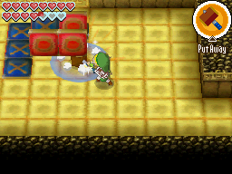

# Mutoh Tiles

- **Game**: Phantom Hourglass
- **Location**: Mutoh's Temple
- **Name**: Xs and Os tiles

## Puzzle

There is a 3x3 set of tiles. Each tile is either **X** (blue) or **O** (red). When you hit a tile with the hammer, that tile and all neighbours (diagonal included) flip. The goal is to make all tiles the same color.

| __X__ | __X__ | __X__ |
| :---: | :---: | :---: |
| __X__ | __O__ | __X__ |
| __X__ | __X__ | __X__ |

In the game you can hit the floor outside the puzzle as well, allowing you to flip corners individually. To make it more difficult, I modelled it assuming you can only hit the 9 puzzle tiles.

## Solution

| Solution             | States | Notes                                           |
| -------------------- | -----: | ----------------------------------------------- |
| Optimal              |      9 | 0.1s (MiniSat, 2.3 GHz Quad-Core Intel Core i7) |
| [Zelda Dungeon][zd]  |        | No instructions given                           |
| [Zelda Universe][zu] |      9 | Hitting the floor outside the puzzle            |

[zd]: https://www.zeldadungeon.net/phantom-hourglass-walkthrough/mutohs-temple/#c12_3
[zu]: https://www.youtube.com/watch?v=0UmE8kV4tPQ&t=460
