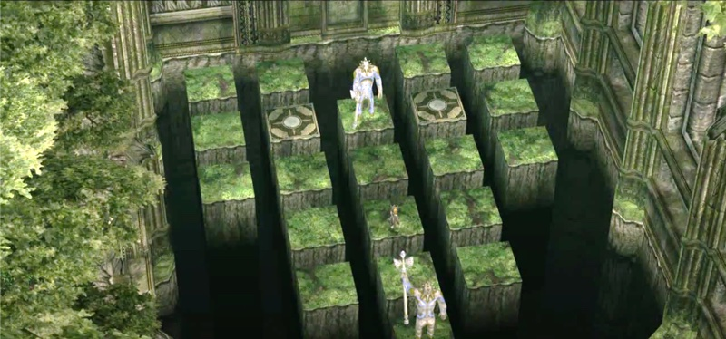

# Sacred Grove

- **Game**: Twilight Princess
- **Location**: Sacred Grove
- **Name**: [Guardian Statues](https://www.zeldadungeon.net/wiki/Sacred_Grove_Guardians)

## Puzzle

Wolk Link (**L**) sits between two statues (**A** above and **B** below). Link can move up, down, left, or right. Each time he moves, Statue **A** moves in the same direction, and Statue **B** moves in the opposite direction. The goal is to get the statues in the positions marked by **x**. Link cannot move onto one of the positions occupied by a statue. (This is true even if it would move out of the way; Link always move first, and then the statues after.) It is game over if a statue jumps on top of Link. If the statues try to go past each other, they bump back into their original place (but Link still moves).

| __.__ | __.__ |       | __.__ | __.__ |
| :---: | :---: | :---: | :---: | :---: |
| __.__ | __x__ | __A__ | __x__ | __.__ |
| __.__ | __.__ | __.__ | __.__ | __.__ |
|       | __.__ | __L__ | __.__ |       |
|       | __.__ | __.__ | __.__ |       |
|       |       | __B__ |       |       |

## Solution

**Note**: This puzzle is symmetrical, so all solutions work on both GameCube and Wii orientations.

| Solution             | States | Notes                                           |
| -------------------- | -----: | ----------------------------------------------- |
| Optimal              |     13 | 1.1s (MiniSat, 2.3 GHz Quad-Core Intel Core i7) |
| [Zelda Dungeon][zd]  |     14 | Steps: L, D, R2, U, L, U2, L, D2, R, U          |
| [Zelda Universe][zu] |     14 | Same as Zelda Dungeon                           |

[zd]: https://www.zeldadungeon.net/twilight-princess-walkthrough/the-master-sword/#c11_3
[zu]: https://zeldauniverse.net/guides/twilight-princess/sidequests/guardian-statue-puzzle/
