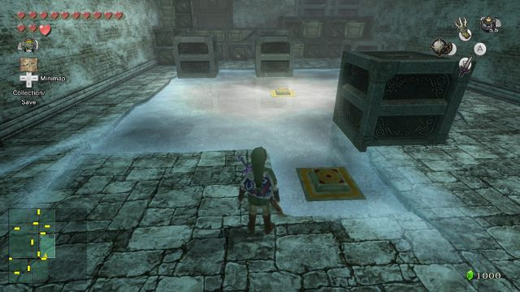

# Snowpeak Blocks

- **Game**: Twilight Princess
- **Location**: Snowpeak Ruins
- **Name**: Sliding Blocks

## Puzzle

Link (**L**) must push blocks (**B**) on an icy surface to press one or more switches (**x**). The blocks slide until they hit an edge, another block, or an obstacle (**o**). Hitting another block does not cause that block to move.

## Configuration 1

On the first visit to this room, there are two blocks, two obstacles, and one switch.

| __o__ | __.__ | __.__ | __.__ | __B__ |
| :---: | :---: | :---: | :---: | :---: |
| __.__ | __.__ | __.__ | __.__ | __.__ |
| __.__ | __.__ | __o__ | __.__ | __.__ |
| __.__ | __.__ | __.__ | __.__ |       |
| __B__ | __.__ | __.__ | __.__ |       |
|       |       | __x__ |       |       |

### Solution

| Solution              | States | Notes                                           |
| --------------------- | -----: | ----------------------------------------------- |
| Optimal               |      6 | 0.8s (MiniSat, 2.3 GHz Quad-Core Intel Core i7) |
| [Zelda Dungeon][zd1]  |      6 | Steps: **B1** E; **B2** W, S, E, S              |
| [Zelda Universe][zu1] |      6 | Same as Zelda Dungeon (but mirrored for Wii)    |

## Configuration 2

The two obstacles in Configuration 1 were actually a frozen block and switch. When you return to the room later in the dungeon, you use the ball and chain to break the ice. There are now three blocks, zero obstacles, and one switch (you only need to press the new one).

| __B__ | __.__ | __.__ | __.__ | __.__ |
| :---: | :---: | :---: | :---: | :---: |
| __.__ | __.__ | __.__ | __.__ | __.__ |
| __.__ | __.__ | __x__ | __.__ | __.__ |
| __.__ | __.__ | __.__ | __.__ |       |
| __.__ | __.__ | __.__ | __B__ |       |
|       |       | __B__ |       |       |

### Solution

| Solution              | Steps | Notes                                           |
| --------------------- | ----: | ----------------------------------------------- |
| Optimal               |     9 | 8.0s (MiniSat, 2.3 GHz Quad-Core Intel Core i7) |
| [Zelda Dungeon][zd2]  |     9 | **B1** N; **B2** S, E, N; **B1** W, S, E, N     |
| [Zelda Universe][zu2] |     9 | Same as Zelda Dungeon (but mirrored for Wii)    |

[zd1]: https://www.zeldadungeon.net/twilight-princess-walkthrough/snowpeak-ruins/#c15_2
[zu1]: https://zeldauniverse.net/guides/twilight-princess/walkthrough/chapter-14-snowpeak-ruins/
[zd2]: https://www.zeldadungeon.net/twilight-princess-walkthrough/snowpeak-ruins/#c15_6
[zu2]: https://zeldauniverse.net/guides/twilight-princess/walkthrough/chapter-14-snowpeak-ruins/
